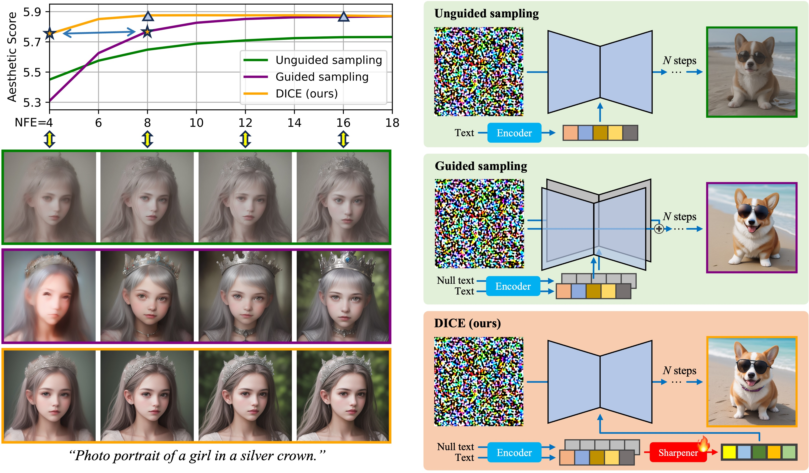
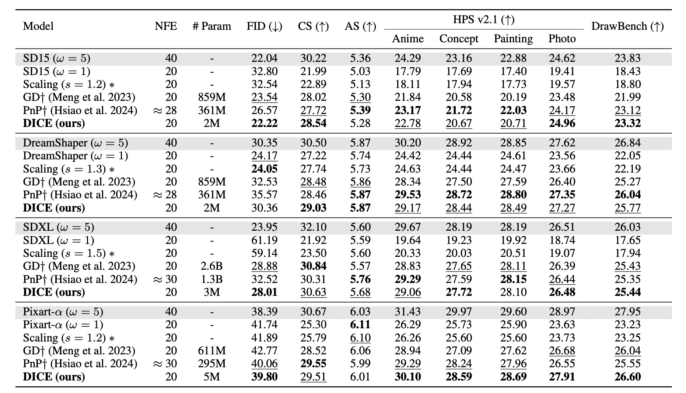

## DICE: Distilling Classifier-Free Guidance into Text Embeddings<br><sub>Official implementation of the AAAI 2026 paper</sub>



**DICE: Distilling Classifier-Free Guidance into Text Embeddings**<br>
Zhenyu Zhou, Defang Chen, Can Wang, Chun Chen, Siwei Lyu
<br>https://arxiv.org/abs/2502.03726<br>

**TL;DR**: With only text embedding modified, our method achieves high-quality unguided text-to-image generation, avoiding the computational drawbacks of classifier-free guidance.

**Abstract**: 
Text-to-image diffusion models are capable of generating high-quality images, but suboptimal pre-trained text representations often result in these images failing to align closely with the given text prompts. Classifier-free guidance (CFG) is a popular and effective technique for improving text-image alignment in the generative process. However, CFG introduces significant computational overhead. In this paper, we present **DI**stilling **C**FG by sharpening text **E**mbeddings (DICE) that replaces CFG in the sampling process with half the computational complexity while maintaining similar generation quality. DICE distills a CFG-based text-to-image diffusion model into a CFG-free version by refining text embeddings to replicate CFG-based directions. In this way, we avoid the computational drawbacks of CFG, enabling high-quality, well-aligned image generation at a fast sampling speed. Furthermore, examining the enhancement pattern, we identify the underlying mechanism of DICE that sharpens specific components of text embeddings to preserve semantic information while enhancing fine-grained details. Extensive experiments on multiple Stable Diffusion v1.5 variants, SDXL, and PixArt-$\alpha$ demonstrate the effectiveness of our method.


## Getting Started
Run the commands in [launch.sh](./launch.sh) for training, sampling and evaluation with recommended settings. 
We use 8 A100 GPUs for all experiments. Feel free to modify the default settings according to your available devices.

### Training

```.bash
# Training DICE sharpener on SD15 and its variants

MODEL_NAME="Lykon/DreamShaper"
n_gpus=8
acc_steps=1
num_updates=8000
accelerate launch --num_processes=$n_gpus --mixed_precision="fp16" train_sd15.py \
  --pretrained_model_name_or_path=$MODEL_NAME \
  --enable_xformers_memory_efficient_attention \
  --gradient_accumulation_steps=$acc_steps \
  --max_train_steps=$(($num_updates*$acc_steps)) \
  --checkpointing_steps=$(($num_updates*$acc_steps/10)) \
  --n_gpus=$n_gpus \
  --guidance_scale=5 \
  --train_batch_size=16 \
  --learning_rate=2e-4 \
  --lr_scheduler="constant" \
  --lr_warmup_steps=0;
```

### Sampling and Evaluation
The trained DICE sharpener is saved in the `./exps` directory with a five-digit experiment ID (e.g., `00003`). It can be directly used during sampling by specifying `--sharpener_path=3` (see the example below). 

```.bash
# Sampling using trained DICE sharpener
model_name="sd15"
sharpener_path=3
sharpener_id=$sharpener_path
steps=20
alpha=1.0
batch_gpu=16
accelerate launch --num_processes=8 sample.py --model_name=$model_name --sharpener_path=$sharpener_path --sharpener_id=$sharpener_id --steps=$steps --alpha=$alpha --batch_gpu=$batch_gpu;

# Evaluation using FID, CLIP score and Aeathetic score
out_folder="${model_name}_${sharpener_id}_steps${steps}_alpha${alpha}"
image_path="./samples/${out_folder}"
ref="/Path/to/reference/statistis"
desc="${out_folder}"
accelerate launch --num_processes=8 ./evaluation/eval_fid.py calc --images=$image_path --ref=$ref --desc=$desc;
accelerate launch --num_processes=8 ./evaluation/eval_clip_score.py calc --images=$image_path --desc=$desc;
accelerate launch --num_processes=8 ./evaluation/eval_aes_score.py calc --images=$image_path --desc=$desc;
```

## Performance



## FID Statistics
To facilitate the FID evaluation, we provide our [FID statistics](https://drive.google.com/drive/folders/1f8qf5qtUewCdDrkExK_Tk5-qC-fNPKpL?usp=sharing) of various datasets. They are collected on the Internet or made by ourselves with the guidance of the [EDM](https://github.com/NVlabs/edm) codebase. 

You can compute the reference statistics for your own datasets as follows:
```
python ./evaluation/eval_fid.py ref --data=path/to/my-dataset.zip --dest=path/to/save/my-dataset.npz
```

## Citation
If you find this repository useful, please consider citing the following paper:

```
@article{zhou2025dice,
  title={DICE: Distilling Classifier-Free Guidance into Text Embeddings},
  author={Zhou, Zhenyu and Chen, Defang and Wang, Can and Chen, Chun and Lyu, Siwei},
  journal={arXiv preprint arXiv:2502.03726},
  year={2025}
}
```
